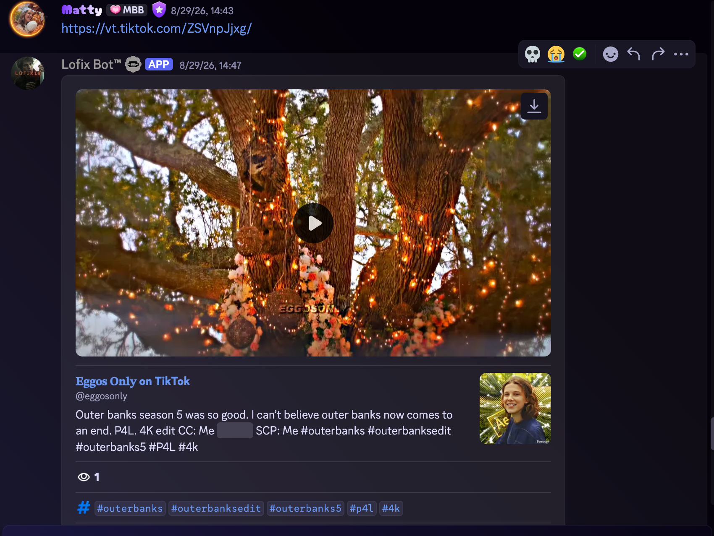
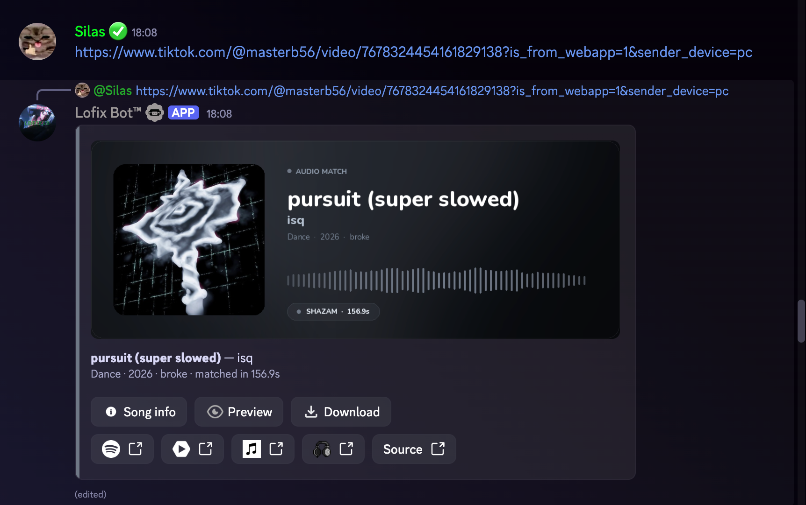
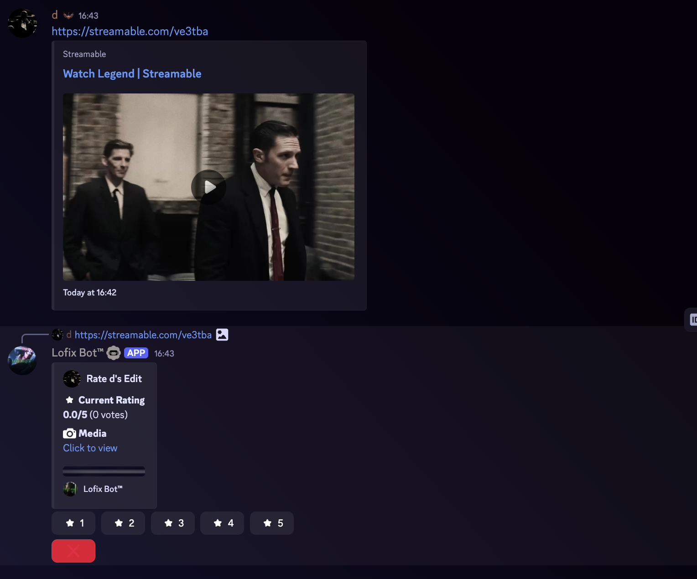

# LofixBot Message Content Intent Evidence

This repository documents why LofixBot requires Discord's Message Content privileged intent.

LofixBot uses Discord application commands for user-invoked features. It does not request Message Content access for prefix commands.

## Required Intent

### Message Content

Message Content access is required for automatic workflows that begin when a member posts a normal message, supported media URL, or attachment:

- Automatic social-media link detection, metadata extraction, and rich media embedding
- Automatic song identification from audio or video attachments and supported media URLs
- Automatic rate-edit workflows for supported media links posted in configured channels

These workflows cannot be replaced by slash-command options without removing their automatic behavior. The bot must receive the posted message content to detect the supported URL or media and process it immediately. Message content is not used for advertising or AI training and is not stored as a general message archive.

## Evidence

The evidence below shows the production LofixBot application reacting to ordinary guild messages without a command or interaction.

### Automatic social-media embedding

A member posts a TikTok URL. LofixBot detects the link and automatically returns a rich media preview with the original media and metadata.

### Automatic song identification

A member posts a TikTok URL. LofixBot automatically processes the linked media, identifies the audio, and returns the matched track with supporting links.

### Automatic rate-edit workflow

A member posts a Streamable URL. LofixBot detects the supported media link and automatically creates the configured rating workflow for that edit.

## Privacy

Read the [LofixBot Privacy Policy](PRIVACY.md).
